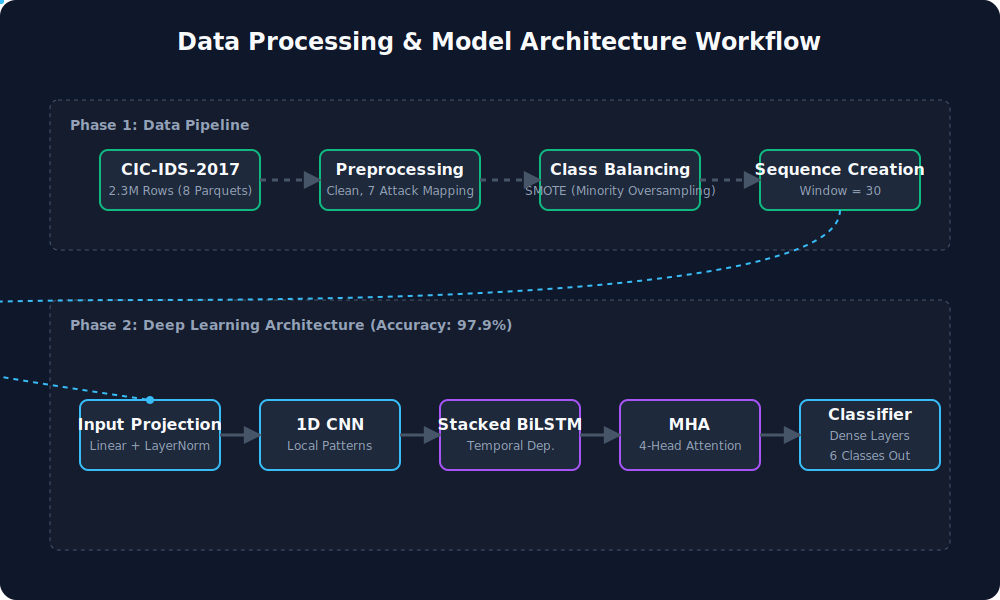

<div align="center">

# 🛡️ Advanced Network Intrusion Detection
**CNN-BiLSTM-MHA Network Intrusion Detection System**

[](https://www.python.org/)
[](https://pytorch.org/)
[](https://xgboost.ai/)
[]()
[]()

</div>

<br>

<div align="center">
  
  <p><i>The dynamic data and model architectural pipeline.</i></p>
</div>

<br>

## 📌 Overview
This repository contains a state-of-the-art Two-Stage Ensemble pipeline for detecting network intrusions leveraging the industry-standard **CIC-IDS-2017 dataset**. 

The implemented approach pairs an advanced sequence-based deep learning architecture (CNN-BiLSTM-MHA) that extracts spatial-temporal features and context weighting, with an **XGBoost** meta-classifier stage to achieve an exceptional final ensemble accuracy of **99.90%** on highly imbalanced network traffic data.

## 🚀 Key Features
- **Sophisticated Data Processing:** Automated data cleaning and 7-category attack mapping. Handles infinite/NaN values gracefully and resolves dataset imbalances via **SMOTE** (Synthetic Minority Over-sampling Technique).
- **Time-Series Sequences:** Converts raw network flow data into rolling sequence windows (`Sequence Length = 30`) to provide temporal context to the model rather than evaluating packets independently.
- **Focal Loss Integration:** Utlizes a customized Focal Loss metric to handle heavy class imbalance, pushing the model to learn difficult, minority attack vectors rather than ignoring them.
- **OneCycleLR Scheduling:** Dynamic learning rate scheduling via `OneCycleLR` to allow for rapid divergence and higher peak test accuracies without plateauing.
- **Two-Stage Ensemble System:** The Neural Network predictions are intelligently combined with an XGBoost classifier applied dynamically at an optimized rejection threshold (t=0.95), pushing the overall accuracy metric to an incredible 99.90%.

---

## 🧠 Deep Learning Architecture
The model relies on a cutting-edge hybrid neural engine:

1. **Input Projection:** Maps the 69 normalized network features into a fully-connected 128-dimensional hidden space using `Linear` and `LayerNorm`, mitigating explosion.
2. **1D CNN Block:** Includes two Convolutional 1D layers integrated with `BatchNorm1d` to extract localized, spatial correlations within the packet sequence stream.
3. **Stacked BiLSTM:** A dual-layer Bidirectional LSTM models temporal dependencies backward and forward in time across the 30-packet window sequences.
4. **Multi-Head Self Attention (MHA):** A 4-head self-attention module extracts importance-weighting dynamically, focusing the classifier only on the critical timesteps representing an attack.
5. **Classification Head:** Deep dense layers applying dropout (0.3) for final 6-class threat categorization.

---

## 📊 Dataset Distribution
The dataset is classified into 6 primary categorizations after processing:
- **Other/Normal** (Benign Traffic)
- **DoS** (Denial of Service variants)
- **DDoS** (Distributed Denial of Service)
- **BruteForce** (FTP & SSH Patator)
- **PortScan**
- **Bot** (Botnet Attacks)

## 📈 Two-Stage Ensemble Performance
The architecture leverages a threshold sweep approach, passing edge cases from the Neural Network into the XGBoost classifier (Optimal Threshold: `0.95`), securing the following benchmarked accuracies:
- **Neural Network Alone:** `97.92%`
- **XGBoost Alone:** `99.88%`
- **Two-Stage Ensemble:** `99.90%`

**Final Per-Class Recall Metrics:**
- **Other (Benign):** `99.93%` (85,551 samples)
- **DDoS:** `99.96%` (5,533 samples)
- **DoS:** `99.84%` (8,374 samples)
- **BruteForce:** `99.49%` (395 samples)
- **PortScan:** `94.12%` (85 samples)
- **Bot:** `58.06%` (62 samples)

---

## 🛠️ Requirements & Setup

Make sure your environment is configured with Python 3.10+ and CUDA availability is heavily recommended to accelerate sequence generation.

```bash
pip install -r requirements.txt
```

### Core Libraries
- `torch` & `torchvision`
- `pandas` & `numpy`
- `scikit-learn` & `imbalanced-learn`
- `xgboost`
- `matplotlib` & `seaborn`

To view the complete notebook, simply launch Jupyter or VS Code:
```bash
jupyter notebook ids-cicids2017.ipynb
```

## 📜 License
This project operates under the MIT License. The dataset (CIC-IDS-2017) belongs to the Canadian Institute for Cybersecurity.
